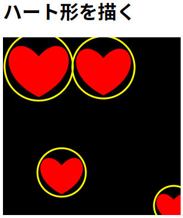

# draw_hearts

## 概要

JavaScriptでハート形を描きます。



## コード

```js
/**
 * ハートを描画する
 * * @param {CanvasRenderingContext2D} ctx - canvas.getContext('2d')
 * @param {number} cx - ハートの中心 x
 * @param {number} cy - ハートの中心 y
 * @param {number} r - ハートの半径（サイズの目安。大きめの値で大きくなる）
 */
function drawHeart(ctx, cx, cy, r) {
    if (r <= 0) return;

    // 比率は試行的に決めたもの。r が全体の「サイズ」になるよう調整。
    // cx, cy はハートの中心（見た目で中心に配置されるよう補正）。
    const topOffset = r * 0.3; // 上のくぼみの高さ
    const leftControlX = cx - r;
    const rightControlX = cx + r;
    const leftControlY = cy - r * 0.6;
    const rightControlY = cy - r * 0.8;
    const bottomY = cy + r * 0.9;

    // ハート下端からスタートして反時計回りに描く
    ctx.moveTo(cx, bottomY);

    // 右下 -> 右上 のベジェ
    ctx.bezierCurveTo(
        cx + r * 1.5, cy + r * 0.15, // 1st control point
        cx + r * 0.8, cy - r * 1.2,  // 2nd control point
        cx, cy - topOffset           // end point (上の中央のくぼみ)
    );

    // 左上 -> 左下 のベジェ
    ctx.bezierCurveTo(
        cx - r * 0.8, cy - r * 1.2,  // 1st control point
        cx - r * 1.5, cy + r * 0.15, // 2nd control point
        cx, bottomY                  // end point (元の下端)
    );
}
```
